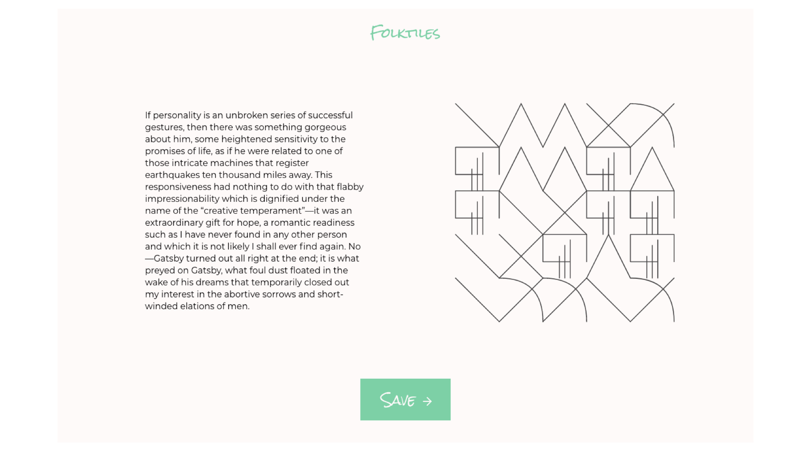

## Journey

1. Create your story
   *As you type a **Tensorflow.js** model analyses the text for emotional sentiment and returns its insights.*
2. Data Representation
   *The sentiment analysis data returned by **Tensorflow** are passed to a separate function that, using **D3.js**, generates a visual representation of the data. Each emotion has a specific shape associated with it, the likelihood of this shape appearing increases with the strength of that emotion.*
3. Share
   *Once you're happy with the story you've written and the data representation that accompanies it, you can share it with the world. The story, and the data representations SVG is written to a **MongoDB** database. From there you're taken to a page where you see your own story alongside the stories and visualisations of others.*

